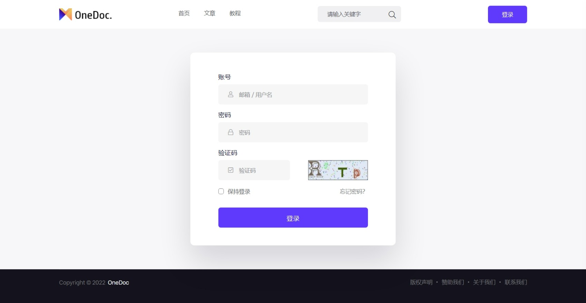
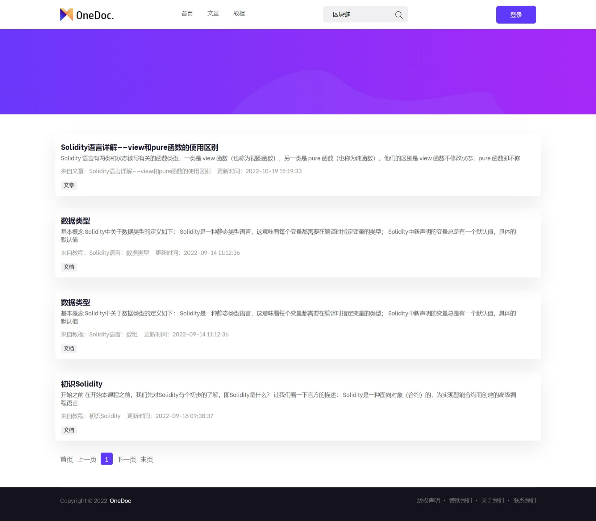

# OneDoc 简介
OneDoc 是一款轻量级的企业（项目）文档协同管理系统。

OneDoc 可以用来储存日常接口文档，数据库字典，手册说明等文档。内置项目管理，用户管理，权限管理等功能，能够满足大部分中小团队的文档管理需求。

OneDoc 基于 [MinDoc](https://github.com/mindoc-org/mindoc) 二次开发。重写了前端页面样式，并更新了部分功能。

OneDoc 适用于以下应用场景：
+ 项目技术资料管理
+ 企业文档资料管理
+ 互联网博客和在线教程网站
+ ......

**演示站点**

*部署中，即将上线。。。*

## 项目技术栈
+ [Beego](https://github.com/beego/beego) （go语言 web 项目框架）
+ [Boostrap](https://getbootstrap.com/) （前端页面框架）
+ [MySQL 5.6](https://www.mysql.com/) （关系数据库）
+ ......

## 更新说明
OneDoc 基于 [MinDoc](https://github.com/mindoc-org/mindoc) 二次开发，主要更新了以下内容：
- 将主菜单中的项目空间栏目改为教程，并更新了部分相关的文字描述
- 更新了前端页面样式，包括：
  + header 页面
  + footer 页面
  + 首页
  + 文章页
  + 教程页
  + 搜索页
  + 登录与注册页
  + ......
- 增加了教程（原项目空间）分类图片
- 增加了文章封面图片
- 增加了文章阅读次数
- 增加了关于我们等静态页面

## 安装与运行
### 安装
第一步，下载或克隆仓库源码到指定的项目目录，并将 static.rar 静态文件的压缩包解压缩到项目根目录。
```
git clone https://github.com/StevenX5/OneDoc.git
```

第二步，按照 [MinDoc](https://github.com/mindoc-org/mindoc) 官方的安装教程进行安装。

第三步，更新部分数据库表结构
1. 更新表 `md_itemsets`，增加 `img_url` 字段
```
imgurl	varchar(500)
```
2. 更新表 `md_blogs`，增加 `cover` 和 `view_count` 字段
```
cover	      varchar(1000)
view_count	int		default(0)
```

### 编译与运行
```
# 编译
go build

# 开发环境运行
bee run

# 生产环境运行
.\OneDoc      # Windows 环境
# 或
./OneDoc      # Linux 环境
```

## 界面截图
**登录**


**首页**


**文章列表**


**教程分类**


**教程列表**


**搜索结果**


**关于我们**


## 关注我们
欢迎关注我们，如果您在使用中有任何问题，请在 Github 上报告 [issue](https://github.com/StevenX5/OneDoc/issues) 给我们。

## 联系我们
QQ：1029993198 (zh***g)
